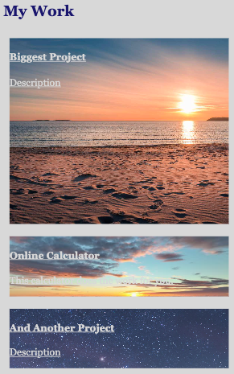

# Professional Portfolio

## Description

The motivation for completing this project was to have an up-to-date portfolio displaying the work done in boot camp. I built this project for two reasons: to further understand flexbox, HTML structural elements, semantic tags, and how to style a webpage with CSS, and to create a working display of my projects for future employers. 

This project will culminate all of my future works into one place, displaying the skills I will learn as a coder, so it solves the problem of showcasing my abilities. I learned how to use flexbox and how to incorporate classes and ids into an HTML file.

## Usage

Click the links in the navigation bar to view each section. Under "My Work" you will see further sections broken down into each project I've completed. To view any project, simply select the image. Your browser will open a new webpage, loading the respective project.

Click this [link](https://www.markdownguide.org/cheat-sheet/) to visit the site.

